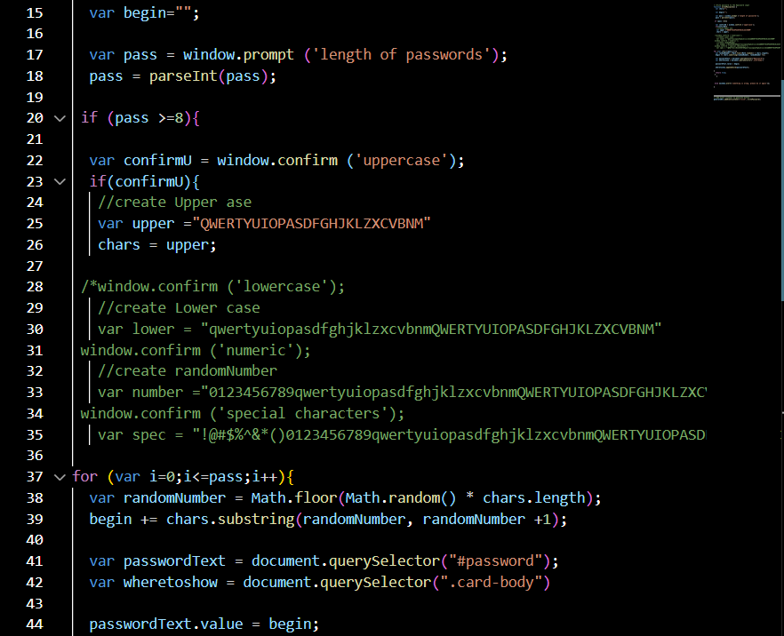

# Challenge-03

## Brain storm
At first I google to figure out how to do generating random charater password ([source](https://dev.to/code_mystery/random-password-generator-using-javascript-6a)) to have the general idea about making password, so it is not my own work.

The (template) script for my challenge will be some what related to 

Then compare to the challenge, I have to figure out how to :

*How to add condition that is greater than 8 character is accept.

*How to prompt uppercase, lowercase, numeric, special character.

## Generating password with condition of 8 and above charater:

Remind of last module, I apply `if` method to make sure I am asked how many charaters for my pasword, and I am only accepted when I enter more than 8, then the (template) script become to 

And the result: 
 
which I want to.

Bonus: I was testing to see if `var chars` will become `var pass` so that I can do my next issue, and it quite work.

Back to challenge, there are some changing that allow me go through the challenge I have my first develop output 

## Generating password with condition

I add `if` method to add more characters for `chars` through several condition.

I move the initial var `begin` and `chars` to the end to define those global chars 

I make the reset for `begin` whenever the `genpass()` function is used.

## Bug

I have one bug that is the window still arlert the "something is wrong, please do it again" after I sastify the conditions of the password lenghth, but with the time limit, I by pass it and hope I can fix it in future.